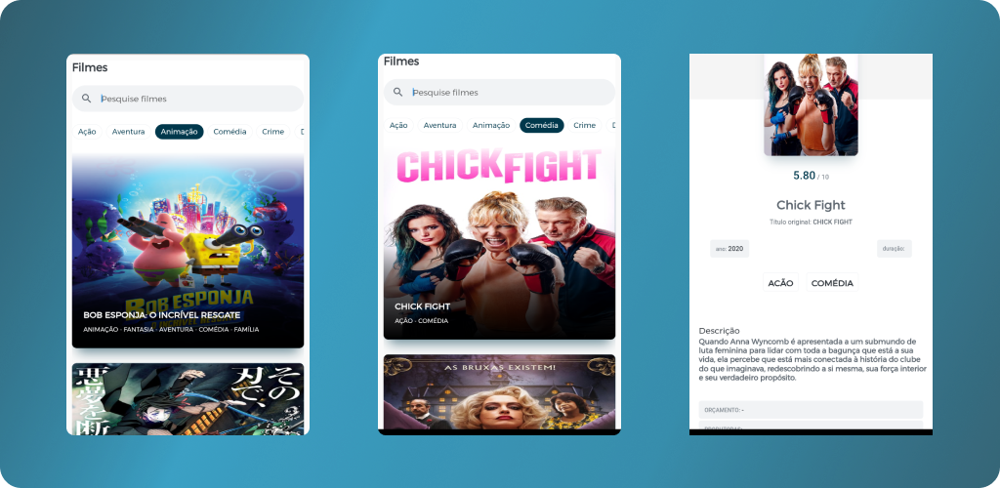

<h1 align="center">
  <br>
  <a href=""></a>
  <br>
    Desafio Cubos - App de filmes 
  <br>
</h1>

<h3>Aplicativo de visualização de filmes, por categorias ou por pesquisa.</h3>
 <p float="left">
  
 </p>


## Como usar
Para clonar e executar este app, voçê irá precisará do [Git](https://git-scm.com) e [Flutter](https://flutter.dev/docs/get-started/install) instalados no seu computador.
Com o git, voçê pode executar o comando ```$ git clone https://github.com/gabriel-oliveira800/defasio-cubos-app-de-filmes ``` para clonar esse repositório. Caso queria renomear a pasta do projeto no seu computador, voçê pode digitar na linha de comando ```$ git clone https://github.com/gabriel-oliveira800/defasio-cubos-app-de-filmes ``` e no final do comando escrever o nome da pasta, ficando desta forma ```$ git clone https://github.com/gabriel-oliveira800/defasio-cubos-app-de-filmes nome-da-pasta```.


Entre na pasta do projeto, ```$ cd defasio-cubos-app-de-filmes```, e abra no seu editor de texto de preferecia ```$ code .```,  instale as depências do projeto executando
```$ flutter packages get ``` e rode o flutter executando ```$ flutter run ```. Também é possivél executaros test no projeto rodando ``` $flutter test ```. E por fim pra gerar um app para produção execute ```$ $flutter build apk ``` ou ```$flutter build appbundle ```, para saber mais sobre deploy de app flutter voçê acessar o site oficial 
do [Flutter](https://flutter.dev/docs/deployment/). 

Visite também o site [The Movie DB](https://developers.themoviedb.org/3/movies/get-movie-details) e crie sua chave para poder pesquisar por filmes, categorias, series etc.
Com sua chave criada pode precisa alterar o arquivo ```api_key.dart```, localizdo ``` lib/src/utils/api_key.dart ``` , informando sua chave de api.
